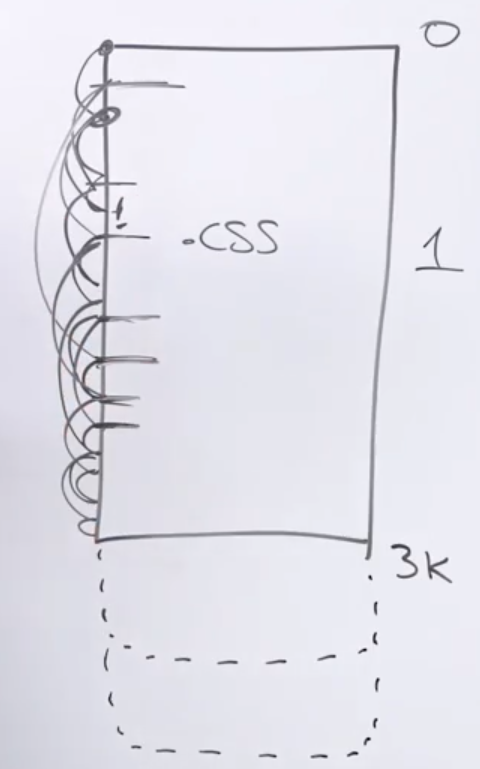
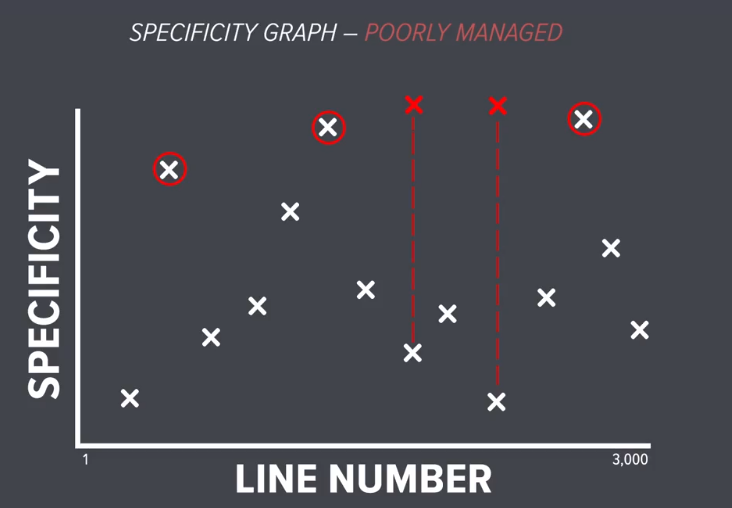
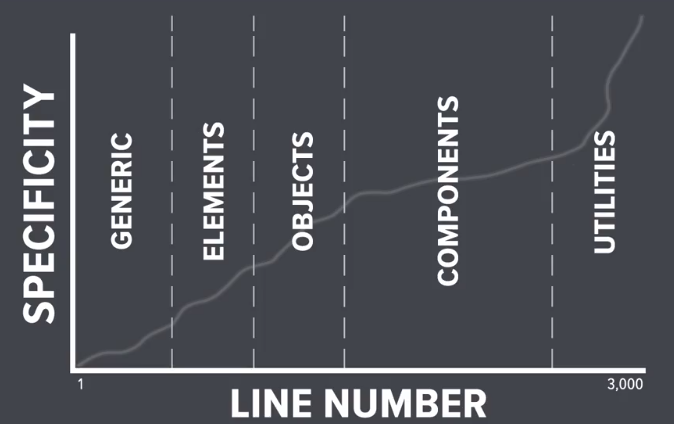

# ITCSS


Issues with CSS at Scale:
### 1: Cascading and inheritance
### 2: Source Order
### 3: Specificity
<br>


<br>
## Specificity War:
<br>



<br>

## Specificity Graph:
<br>



Issues with Developers

### 1: Veried coding styles
### 2: Lack of documentation
### 3: Range of skill level
<br>

ITCSS stands for Inverted Triangle CSS. It is a methodology or architecture for organizing and structuring CSS code in a scalable and maintainable manner. ITCSS was introduced by Harry Roberts and it aims to address some of the common issues in CSS, such as specificity conflicts and difficulty in managing large codebases.

You can use ITCSS with preprocessors or without them and it is compatible with CSS methodologies like BEM, SMACSS or OOCSS.


The ITCSS architecture suggests organizing CSS code in a specific order, with each layer building upon the previous one. The layers are arranged in an inverted triangle shape, hence the name. The layers, in order from bottom to top, are as follows:

## Setting
   This layer includes global variables, configuration settings, and Sass/Less variables. It defines the core values and settings that are used throughout the project.

   The Settings layer is where you would typically store values that are frequently used across your stylesheets. This could include variables for colors, font sizes, spacing values, breakpoints, or any other values that you want to define once and reuse throughout your styles.

   By centralizing these settings in the Settings layer, you can easily update them in one place, which helps to maintain consistency across your stylesheets.
   
   For example, if you decide to change the primary color of your website, you can simply update the color value in the Settings layer, and it will be reflected throughout your CSS codebase.

## Tools
   This layer includes mixins and functions that provide reusable styles and functionality. It contains code that doesn't output any CSS itself but is used by other layers.

   The purpose of the Tools layer is to provide a collection of useful tools and utilities that can be leveraged across different parts of the project. These tools can include Sass/Less mixins, functions, placeholders, or any other code snippets that assist in writing CSS.

   Here are some examples of what you might find in the Tools layer:

   - Mixins: Mixins are reusable chunks of CSS code that can be included in other styles
   - Functions: Functions in Sass or Less allow you to perform calculations, manipulate values, or generate dynamic CSS
   - Placeholders: Placeholders, also known as silent classes, are selectors that do not output any CSS on their own. Instead, they can be extended by other selectors, allowing you to reuse common sets of styles without adding additional specificity.
  
   - Utility classes: The Tools layer can also include utility classes that provide helper styles for specific scenarios. These utility classes are often small, single-purpose classes that can be applied directly to HTML elements to modify their appearance or behavior.
  
   Utility Classes Examples:

    1: Text alignment: .text-left, .text-center, .text-justify
    2: Display and visibility: .hidden, .visible, .invisible
    3: Margin: .m-0, .p-4, .mt-4
    4: Typography: .font-bold, .text-sm, .text-red, .uppercase
    5: Borders: .border, .border-solid, .border-radius
    6: Flexbox utilities: .flex, .flex-row, .flex-wrap, .justify-center
## Generic
   This layer includes CSS resets, normalize styles, and other globally applicable styles. It aims to provide a consistent base across different browsers and devices.
 
 1: CSS reset
```body,
p,
ul,
ol {
  margin: 0;
  padding: 0;
}
```

2: Box-sizing:
```
*,
*::before,
*::after {
  box-sizing: border-box;
}
```

3: Typography:
```
body {
  font-family: Arial, sans-serif;
  font-size: 16px;
  line-height: 1.5;
}

h1 {
  font-size: 24px;
  font-weight: bold;
}

```

4: Links:
```
a {
  color: blue;
  text-decoration: underline;
}

a:hover {
  color: darkblue;
  text-decoration: none;
}
```

## Elements
   This layer includes the styling for bare HTML elements (e.g., headings, paragraphs, links). It defines the default styles for these elements.

Examples:

1: Headling
```
h1 {
  font-size: 2rem;
  font-weight: bold;
  /* Other styles */
}

h2 {
  font-size: 1.8rem;
  font-weight: bold;
  /* Other styles */
}

/* Styles for h3, h4, h5, h6 */

```

2: Paragraph: 
```
p {
  line-height: 1.5;
  /* Other styles */
}

```

3: Links: 

```
a {
  color: blue;
  text-decoration: underline;
  /* Other styles */
}

a:hover {
  color: darkblue;
  text-decoration: none;
}

```
## Objects
  This layer includes reusable design patterns or components that can be used throughout the project. These components are typically UI-centric and don't have any cosmetic styles.
  
   Grid system:

```
.container {
  width: 100%;
  max-width: 1200px;
  margin: 0 auto;
}

.row {
  display: flex;
  flex-wrap: wrap;
  margin: 0 -15px; /* Adjust as per your grid gutter size */
}

.column {
  flex: 1 0 0;
  padding: 0 15px; /* Adjust as per your grid gutter size */
}

```

Media Object:

```
.media {
  display: flex;
  align-items: center;
}

.media__image {
  flex: 0 0 auto;
  margin-right: 15px; /* Adjust spacing between image and content */
}

.media__content {
  flex: 1 1 auto;
}

```
Alignment Classes

```
.text-center {
  text-align: center;
}

.vertical-center {
  display: flex;
  align-items: center;
}
```


## Components
   This layer includes specific UI components that have cosmetic styles applied to them. It focuses on individual, self-contained parts of the UI.

   Examples: 

1: Button Component:

```
.button {
  display: inline-block;
  padding: 10px 20px;
  font-size: 16px;
  font-weight: bold;
  text-align: center;
  text-decoration: none;
  color: #ffffff;
  background-color: #007bff;
  border: none;
  border-radius: 4px;
  cursor: pointer;
}

.button:hover {
  background-color: #0056b3;
}

.button--secondary {
  background-color: #6c757d;
}

.button--secondary:hover {
  background-color: #4e555a;
}
```

2: Card Component:

```
.card {
  display: flex;
  flex-direction: column;
  border-radius: 4px;
  box-shadow: 0 2px 4px rgba(0, 0, 0, 0.1);
  overflow: hidden;
  background-color: #ffffff;
}

.card__header {
  padding: 20px;
  background-color: #f2f2f2;
  font-weight: bold;
}

.card__content {
  padding: 20px;
}

.card__footer {
  padding: 20px;
  background-color: #f2f2f2;
}

```

3: Alert Component:

```
.alert {
  padding: 10px;
  font-weight: bold;
  border-radius: 4px;
}

.alert--success {
  color: #155724;
  background-color: #d4edda;
  border: 1px solid #c3e6cb;
}

.alert--error {
  color: #721c24;
  background-color: #f8d7da;
  border: 1px solid #f5c6cb;
}

.alert--warning {
  color: #856404;
  background-color: #fff3cd;
  border: 1px solid #ffeeba;
}
```

## Utilities
   This layer includes utility classes or helper classes that can be used to override or modify styles quickly. It provides a way to make small adjustments to specific elements without having to create new styles or components.


## Conclusions
The idea behind ITCSS is to establish a clear hierarchy and specificity order in CSS, making it easier to manage and maintain code as the project grows. It promotes separation of concerns and modularity, allowing for easier collaboration and reusability of code.

By following the ITCSS methodology, developers can create more scalable and maintainable CSS codebases, reduce specificity conflicts, and improve the overall organization of their stylesheets.


Example Project: https://github.com/csswizardry/discovr